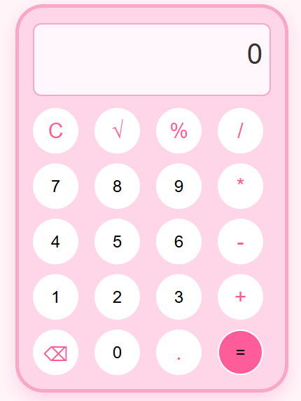

# 🌸Calculator

A responsive and stylish **Pink Calculator** built using **HTML, CSS, and JavaScript**. This project performs basic arithmetic operations while featuring a clean pastel pink user interface and smooth user experience.

🚀 **Live Demo:** https://amritasoni-dev.github.io/Calculator/

## ✨ Features

- ➕ Addition
- ➖ Subtraction
- ✖ Multiplication
- ➗ Division
- √ square root
- 🧮 Percentage (%)
- 🗑 Clear (C) button
- 🔢 Decimal calculations
- 📱 Responsive and modern design

## 🛠️ Technologies Used

- HTML5
- CSS3
- JavaScript 

## 📂 Project Structure

```
Calculator/
│── index.html
│── style.css
│── script.js
│── README.md
```

## 🚀 How to Run

1. Clone this repository
   ```bash
   git clone https://github.com/amritasoni-dev/Calculator.git
   ```

2. Open the project folder.

3. Double-click **index.html** or open it in your browser.

## 📸 Screenshot



## 🎯 What I Learned

- Structuring web pages using HTML
- Styling layouts with CSS Grid and Flexbox
- Creating responsive user interfaces
- Handling user interactions with JavaScript
- Implementing calculator logic using DOM manipulation

## 👩‍💻 Author

**Amrita Soni**

GitHub: https://github.com/amritasoni-dev

---

⭐ If you like this project, consider giving it a star!
